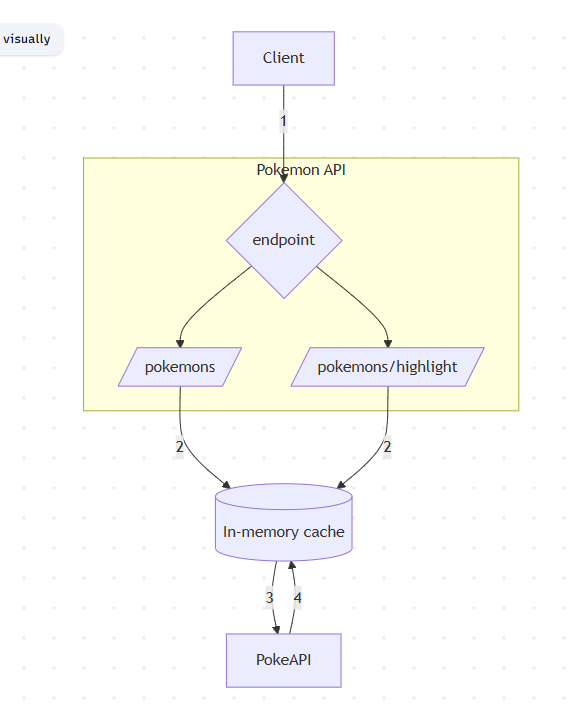
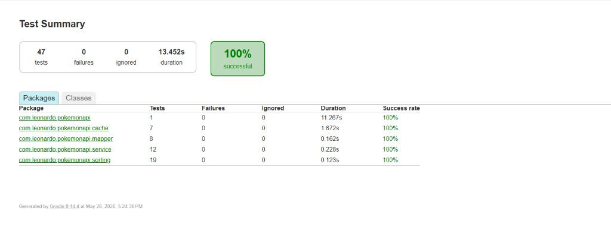

# Pokémon REST API — Backend Challenge

Microserviço em **Kotlin** (toolchain **Java 21**), **Spring Boot 3** e **Gradle**, com **WebFlux**. Consome a **PokéAPI** via **WebClient**.

## O que a aplicação implementa

- ✅ **Ordenação manual** — quicksort e comparações escritas à mão; **sem** `Comparator`, `sortedWith`, `compareBy`, `Collections.sort`, etc.
- ✅ **Busca textual** — substring **case insensitive** sobre nomes.
- ✅ **Highlight** — envolve o match em `<pre>…</pre>` no JSON de resposta.
- ✅ **Cache manual em RAM**.
- ✅ **Docker** — `Dockerfile` multi-stage + `docker-compose.yml`.

## 📚 Documentação

Os 5 documentos a seguir contém as explicações e respostas de todos os requisitos não funcionais do desafio

| Documento | Conteúdo |
|-----------|-----------|
| [ARCHITECTURE.md](ARCHITECTURE.md) | Camadas, fluxo de dados, padrões, SOLID |
| [sorting-algorithm.md](sorting-algorithm.md) |Explicações sobre: Quicksort, critérios, Big-Θ |
| [bottlenecks.md](bottlenecks.md) | Gargalos da aplicação e possíveis melhorias |
| [performance.md](performance.md) | Explicações sobre performance(foco em cache) |
| [metrics.md](metrics.md) | Métricas de observabilidade(actuator, micrometer, snapshot do cache) |

##  Arquitetura (visão geral)

O projeto segue **Layered Architecture** por pacotes: prioriza **separação de responsabilidades**, **alta coesão**, **baixo acoplamento**, **testabilidade** e evolução sem “god classes”. Detalhes, diagramas e correlação SOLID: **[ARCHITECTURE.md](ARCHITECTURE.md)**.

### 📌 Fluxo arquitetural (resumo)


## 📂 Estrutura das camadas (`com.leonardo.pokemonapi`)
o DESIGN pattern utilizado foi o **Layered Architecture**
```text	
└─ src/
   ├─ main/
   │  ├─ kotlin/
   │  │  └─ com/
   │  │     └─ leonardo/
   │  │        └─ pokemonapi/
   │  │           ├─ PokemonApiApplication.kt
   │  │           ├─ cache/
   │  │           │  └─ PokemonCatalogCache.kt
   │  │           ├─ client/
   │  │           │  └─ PokeApiClient.kt
   │  │           ├─ config/
   │  │           │  └─ WebClientConfig.kt
   │  │           ├─ controller/
   │  │           │  ├─ CacheCatalogMetricsController.kt
   │  │           │  ├─ PokemonHighlightController.kt
   │  │           │  ├─ PokemonListController.kt
   │  │           │  └─ RootController.kt
   │  │           ├─ dto/
   │  │           │  └─ response/
   │  │           │     ├─ PokemonCatalogCacheMetricsResponse.kt
   │  │           │     ├─ PokemonHighlightResponse.kt
   │  │           │     └─ PokemonListResponse.kt
   │  │           ├─ exception/
   │  │           │  ├─ PokeApiIntegrationException.kt
   │  │           │  ├─ PokemonApplicationLifecycleException.kt
   │  │           │  ├─ PokemonBackgroundJobException.kt
   │  │           │  ├─ PokemonCatalogFetchException.kt
   │  │           │  ├─ PokemonCatalogStorageException.kt
   │  │           │  ├─ PokemonDataProcessingException.kt
   │  │           │  └─ PokemonReactiveWebException.kt
   │  │           ├─ mapper/
   │  │           │  ├─ PokemonHighlightMapper.kt
   │  │           │  └─ PokemonListMapper.kt
   │  │           ├─ schedulers/
   │  │           │  ├─ CacheMetricsScheduler.kt
   │  │           │  ├─ CachePreRefreshScheduler.kt
   │  │           │  └─ StaleWhileRevalidateScheduler.kt
   │  │           ├─ service/
   │  │           │  ├─ PokemonCatalogCacheMetricsService.kt
   │  │           │  ├─ PokemonFetchService.kt
   │  │           │  ├─ PokemonFilterService.kt
   │  │           │  ├─ PokemonHighlightSearchService.kt
   │  │           │  ├─ PokemonListSearchService.kt
   │  │           │  ├─ PokemonResponseService.kt
   │  │           │  └─ PokemonSortService.kt
   │  │           └─ sorting/
   │  │              ├─ AlphabeticalPokemonNameSorter.kt
   │  │              ├─ LengthPokemonNameSorter.kt
   │  │              ├─ ManualQuicksort.kt
   │  │              ├─ PokemonNameComparisons.kt
   │  │              ├─ PokemonNameSorter.kt
   │  │              └─ PokemonSortType.kt

```


## ⚡ Ordenação

Resumo: **quicksort**; complexidade e critérios em **[sorting-algorithm.md](sorting-algorithm.md)**. Melhoria futura (sort híbrido): **[bottlenecks.md](bottlenecks.md)**.

## 🛡️ Engenharia de qualidade

- ✅ **Injeção por construtor** — **sem** `@Autowired` / field injection.
- ✅ **Sem “codegen” proibido pelo desafio** — sem Lombok, Feign, Spring Data JPA, etc.; Kotlin `data class` para DTOs (não são Java Records).
- ✅ **Agendamento** — só JDK (`ScheduledExecutorService`), alinhado ao enunciado.
- ✅ **Testes** — JUnit 5, AssertJ, `reactor-test` onde faz sentido.

## 🐳 Como executar

**Pré-requisitos:** Docker + Docker Compose *(ou JDK 21 local para `./gradlew bootRun`)*.

Na raiz do projeto:

```bash
docker compose up --build
```

Encerrar:

```bash
docker compose down
```

**Estratégia Docker:** multi-stage build (Gradle compila → JRE fina), imagem base **Eclipse Temurin 21**, porta **8080**.

## 🛣️ Endpoints

### 1. Listagem — `GET /pokemons`

| Parâmetro | Descrição |
|-----------|-------------|
| `query` | Opcional; substring **case insensitive**; vazio = todos. |
| `sort` | Opcional; `ALPHABETICAL` / `ALPHA` / `LENGTH` (ver `PokemonSortType`). |

**Exemplo:** `GET http://localhost:8080/pokemons?query=pika&sort=ALPHABETICAL`

```json
{ "result": ["pikachu"] }
```

### 2. Highlight — `GET /pokemons/highlight`

**Exemplo:** `GET http://localhost:8080/pokemons/highlight?query=pi&sort=LENGTH`

```json
{
  "result": [
    { "name": "pichu", "highlight": "<pre>pi</pre>chu" },
    { "name": "pikachu", "highlight": "<pre>pi</pre>kachu" }
  ]
}
```

### 3. Operacional — `GET /internal/cache-catalog/metrics`

Snapshot do cache (sem lista de nomes). Ver **[metrics.md](metrics.md)**.

## 🧪 Testes

Execute na **raiz do projeto** (`pokemon.api`).

### Com JDK 21 instalado

| Ambiente | Comando |
|----------|---------|
| Git Bash / Linux / macOS | `./gradlew test` |
| PowerShell / CMD (Windows) | `.\gradlew.bat test` |

### Sem JDK 21 (Docker)

O Docker precisa estar em execução.

| Ambiente | Comando |
|----------|---------|
| **PowerShell** (Windows) | `.\run-tests.ps1` |
| **Git Bash** (Linux / macOS / Windows) | `bash run-tests.sh` |

> No Git Bash, **não** use `.\run-tests.ps1` — esse script é só para PowerShell. O `run-tests.sh` já define `MSYS_NO_PATHCONV=1` no Windows.

### Relatório HTML (após os scripts Docker)

Quando a execução no terminal terminar (`BUILD SUCCESSFUL` ou `BUILD FAILED`), o sistema pode exibir um **pop-up** pedindo para escolher um navegador para abrir um arquivo. Selecione o browser de sua preferência (Chrome, Edge, Firefox, etc.).

O relatório Gradle/JUnit abre em `build/reports/tests/test/index.html` e mostra o resumo dos testes (total, falhas, ignorados, duração e taxa de sucesso por pacote), como no exemplo abaixo:



## 📊 Gargalos & performance

Análise estruturada: **[bottlenecks.md](bottlenecks.md)** · modelo de custo e leitura de métricas: **[performance.md](performance.md)**.

## 👨‍💻 Stack tecnológica

| Tecnologia | Finalidade |
|------------|------------|
| Kotlin | Linguagem |
| Java 21 (toolchain) | Runtime / compilação |
| Spring Boot 3 | Framework |
| Spring WebFlux | REST reativo |
| WebClient | Cliente HTTP PokéAPI |
| Gradle | Build |
| Docker | Containerização |
| JUnit 5 / AssertJ / reactor-test | Testes |
| Spring Boot Actuator | Health / metrics |
